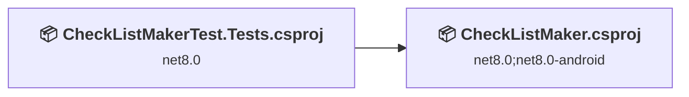
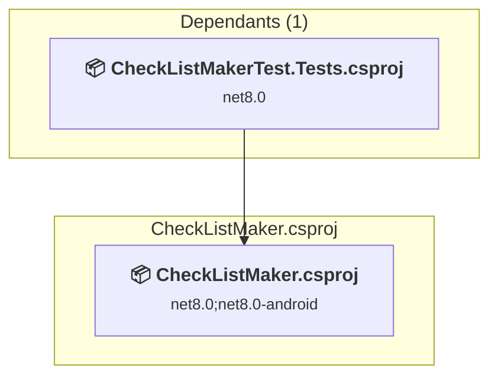
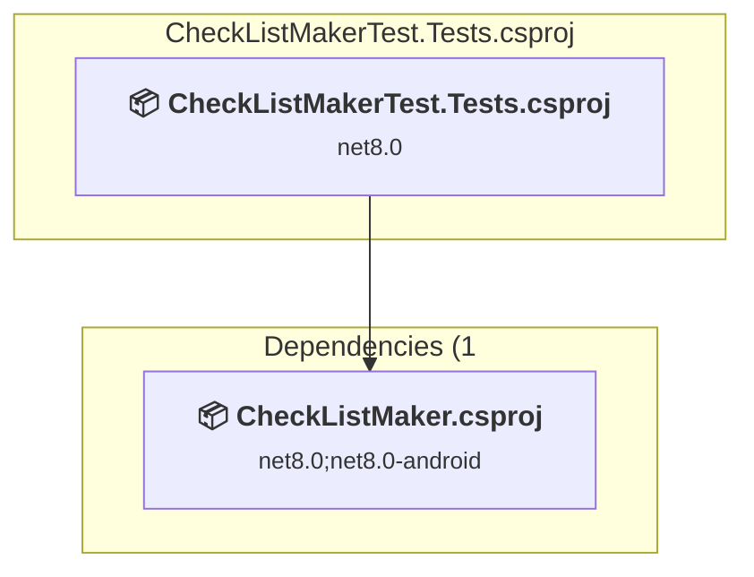

# プロジェクトと依存関係の分析

このドキュメントは、.NETCoreApp, Version=v10.0 へのアップグレードに関連するプロジェクトとその依存関係の包括的な概要を提供します。

## 目次

- [概要](#概要)
  - [🔴 重要: Azure AI Vision 廃止対応が必要](#重要-azure-ai-vision-廃止対応が必要)
  - [全体メトリクス](#全体メトリクス)
  - [プロジェクト互換性](#プロジェクト互換性)
  - [パッケージ互換性](#パッケージ互換性)
  - [API 互換性](#api-互換性)
- [NuGet パッケージ詳細（集約）](#nuget-パッケージ詳細集約)
- [主要な API 移行の課題](#主要な-api-移行の課題)
  - [技術と機能](#技術と機能)
  - [最も頻繁に発生する API の問題](#最も頻繁に発生する-api-の問題)
- [プロジェクト関係図](#プロジェクト関係図)
- [プロジェクト詳細](#プロジェクト詳細)

  - [CheckListMaker\CheckListMaker.csproj](#checklistmakerchecklistmakercsproj)
  - [CheckListMakerTest.Tests\CheckListMakerTest.Tests.csproj](#checklistmakertesttestschecklistmakertesttestscsproj)

## 概要

### 🔴 重要: Azure AI Vision 廃止対応が必要

**Microsoft からの通知**: "Azure AI Vision Image Analysis will be retired on 25 September 2028. Replace with alternative Azure features"

#### 現在の使用状況
- **使用パッケージ**: `Microsoft.Azure.CognitiveServices.Vision.ComputerVision` v7.0.1
- **使用箇所**: 
  - `CheckListMaker/Services/ComputerVisionService.cs` - OCR 処理によるチェックリスト生成
  - `CheckListMakerTest.Tests/MauiApps/Services/ComputerVisionServiceTests.cs` - 単体テスト
- **主な機能**: `ReadInStreamAsync` API を使用した画像からのテキスト抽出（OCR）

#### 推奨される移行パス
1. **Azure AI Vision v4.0 SDK への移行** (推奨)
   - 新パッケージ: `Azure.AI.Vision.ImageAnalysis` (v1.0.0-beta.3 以降)
   - 最新の Read API を使用
   - .NET 10 との完全互換性
   - 2028年以降もサポート継続

2. **代替案: Azure AI Document Intelligence**
   - より高度な OCR 機能（レイアウト解析、表認識）
   - パッケージ: `Azure.AI.FormRecognizer` v4.x

#### 対応方針
この .NET 8 → 10 アップグレードと併せて、Azure AI Vision v4.0 SDK への移行を実施します。

---

### 全体メトリクス

| 項目 | 数 | 状況 |
| :--- | :---: | :--- |
| 総プロジェクト数 | 2 | すべてアップグレードが必要 |
| 総 NuGet パッケージ数 | 23 | 9 個のアップグレードが必要 |
| 総コードファイル数 | 59 |  |
| 問題のあるコードファイル数 | 54 |  |
| 総コード行数 | 3886 |  |
| 総問題数 | 967 |  |
| 修正予定コード行数 | 955+ | コードベースの少なくとも 24.6% |

### プロジェクト互換性

| プロジェクト | ターゲットフレームワーク | 難易度 | パッケージ問題 | API 問題 | 予測 LOC 影響 | 説明 |
| :--- | :---: | :---: | :---: | :---: | :---: | :--- |
| [CheckListMaker\CheckListMaker.csproj](#checklistmakerchecklistmakercsproj) | net8.0;net8.0-android | 🟢 低 | 9 | 615 | 615+ | ClassLibrary, Sdk Style = True |
| [CheckListMakerTest.Tests\CheckListMakerTest.Tests.csproj](#checklistmakertesttestschecklistmakertesttestscsproj) | net8.0 | 🟢 低 | 1 | 340 | 340+ | DotNetCoreApp, Sdk Style = True |

### パッケージ互換性

| 状況 | 数 | 割合 |
| :--- | :---: | :---: |
| ✅ 互換性あり | 14 | 60.9% |
| ⚠️ 非互換 | 1 | 4.3% |
| 🔄 アップグレード推奨 | 8 | 34.8% |
| ***総 NuGet パッケージ数*** | ***23*** | ***100%*** |

### API 互換性

| カテゴリ | 数 | 影響 |
| :--- | :---: | :--- |
| 🔴 バイナリ非互換 | 3 | 高 - コード変更が必要 |
| 🟡 ソース非互換 | 952 | 中 - 再コンパイルと潜在的な API エラー修正が必要 |
| 🔵 動作変更 | 0 | 低 - 実行時テストが必要になる可能性のある動作変更 |
| ✅ 互換性あり | 4962 |  |
| ***総分析 API 数*** | ***5917*** |  |

## NuGet パッケージ詳細（集約）

| パッケージ | 現在のバージョン | 推奨バージョン | プロジェクト | 説明 |
| :--- | :---: | :---: | :--- | :--- |
| CommunityToolkit.Maui | 9.1.1 |  | [CheckListMaker.csproj](#checklistmakerchecklistmakercsproj) [CheckListMakerTest.Tests.csproj](#checklistmakertesttestschecklistmakertesttestscsproj) | ✅Compatible |
| CommunityToolkit.Mvvm | 8.4.0 |  | [CheckListMaker.csproj](#checklistmakerchecklistmakercsproj) | ✅Compatible |
| coverlet.collector | 6.0.4 |  | [CheckListMakerTest.Tests.csproj](#checklistmakertesttestschecklistmakertesttestscsproj) | ✅Compatible |
| LiteDB | 5.0.21 |  | [CheckListMaker.csproj](#checklistmakerchecklistmakercsproj) [CheckListMakerTest.Tests.csproj](#checklistmakertesttestschecklistmakertesttestscsproj) | ✅Compatible |
| Microsoft.Azure.CognitiveServices.Vision.ComputerVision | 7.0.1 |  | [CheckListMaker.csproj](#checklistmakerchecklistmakercsproj) [CheckListMakerTest.Tests.csproj](#checklistmakertesttestschecklistmakertesttestscsproj) | ✅Compatible |
| Microsoft.Extensions.Configuration | 8.0.0 | 10.0.2 | [CheckListMaker.csproj](#checklistmakerchecklistmakercsproj) | NuGet パッケージのアップグレードをおすすめします |
| Microsoft.Extensions.Configuration.Binder | 8.0.2 | 10.0.2 | [CheckListMaker.csproj](#checklistmakerchecklistmakercsproj) | NuGet パッケージのアップグレードをおすすめします |
| Microsoft.Extensions.Configuration.FileExtensions | 8.0.1 | 10.0.2 | [CheckListMaker.csproj](#checklistmakerchecklistmakercsproj) | NuGet パッケージのアップグレードをおすすめします |
| Microsoft.Extensions.Configuration.Json | 8.0.1 | 10.0.2 | [CheckListMaker.csproj](#checklistmakerchecklistmakercsproj) | NuGet パッケージのアップグレードをおすすめします |
| Microsoft.Extensions.Configuration.UserSecrets | 8.0.1 | 10.0.2 | [CheckListMaker.csproj](#checklistmakerchecklistmakercsproj) | NuGet パッケージのアップグレードをおすすめします |
| Microsoft.Extensions.Logging.Abstractions | 8.0.3 | 10.0.2 | [CheckListMaker.csproj](#checklistmakerchecklistmakercsproj) | NuGet パッケージのアップグレードをおすすめします |
| Microsoft.Extensions.Logging.Debug | 8.0.1 | 10.0.2 | [CheckListMaker.csproj](#checklistmakerchecklistmakercsproj) | NuGet パッケージのアップグレードをおすすめします |
| Microsoft.Maui.Controls | 8.0.100 |  | [CheckListMaker.csproj](#checklistmakerchecklistmakercsproj) | ✅Compatible |
| Microsoft.Maui.Controls.Compatibility | 8.0.100 |  | [CheckListMaker.csproj](#checklistmakerchecklistmakercsproj) | ✅Compatible |
| Microsoft.NET.Test.Sdk | 17.14.1 |  | [CheckListMakerTest.Tests.csproj](#checklistmakertesttestschecklistmakertesttestscsproj) | ✅Compatible |
| Moq | 4.20.72 |  | [CheckListMakerTest.Tests.csproj](#checklistmakertesttestschecklistmakertesttestscsproj) | ✅Compatible |
| Newtonsoft.Json | 13.0.3 | 13.0.4 | [CheckListMaker.csproj](#checklistmakerchecklistmakercsproj) | NuGet パッケージのアップグレードをおすすめします |
| Plugin.MauiMTAdmob | 2.0.0.5 |  | [CheckListMaker.csproj](#checklistmakerchecklistmakercsproj) [CheckListMakerTest.Tests.csproj](#checklistmakertesttestschecklistmakertesttestscsproj) | ✅Compatible |
| StyleCop.Analyzers | 1.1.118 |  | [CheckListMaker.csproj](#checklistmakerchecklistmakercsproj) | ✅Compatible |
| System.Private.Uri | 4.3.2 |  | [CheckListMaker.csproj](#checklistmakerchecklistmakercsproj) | ✅Compatible |
| System.Text.RegularExpressions | 4.3.1 |  | [CheckListMaker.csproj](#checklistmakerchecklistmakercsproj) | NuGet パッケージの機能は、フレームワークの参照に含まれています |
| xunit | 2.9.3 |  | [CheckListMakerTest.Tests.csproj](#checklistmakertesttestschecklistmakertesttestscsproj) | ⚠️NuGet パッケージは非推奨です |
| xunit.runner.visualstudio | 3.1.1 |  | [CheckListMakerTest.Tests.csproj](#checklistmakertesttestschecklistmakertesttestscsproj) | ✅Compatible |

## 主要な API 移行の課題

### 技術と機能

| 技術 | 問題数 | 割合 | 移行パス |
| :--- | :---: | :---: | :--- |

### 最も頻繁に発生する API の問題

| API | 数 | 割合 | カテゴリ |
| :--- | :---: | :---: | :--- |
| T:Microsoft.Maui.Controls.Animation | 180 | 18.8% | ソース非互換 |
| P:Microsoft.Maui.Controls.InputView.TextColor | 104 | 10.9% | ソース非互換 |
| M:Microsoft.Maui.Controls.Animation.#ctor(System.Action{System.Double},System.Double,System.Double,Microsoft.Maui.Easing,System.Action) | 80 | 8.4% | ソース非互換 |
| M:Microsoft.Maui.Controls.Animation.Add(System.Double,System.Double,Microsoft.Maui.Controls.Animation) | 80 | 8.4% | ソース非互換 |
| P:Microsoft.Maui.Controls.TimePicker.TextColor | 26 | 2.7% | ソース非互換 |
| P:Microsoft.Maui.Controls.Picker.TextColor | 26 | 2.7% | ソース非互換 |
| P:Microsoft.Maui.Controls.Button.TextColor | 26 | 2.7% | ソース非互換 |
| P:Microsoft.Maui.Controls.RadioButton.TextColor | 26 | 2.7% | ソース非互換 |
| P:Microsoft.Maui.Controls.Label.TextColor | 26 | 2.7% | ソース非互換 |
| P:Microsoft.Maui.Controls.DatePicker.TextColor | 26 | 2.7% | ソース非互換 |
| T:Microsoft.Maui.Easing | 20 | 2.1% | ソース非互換 |
| M:Microsoft.Maui.Controls.Animation.#ctor | 20 | 2.1% | ソース非互換 |
| M:Microsoft.Maui.Controls.Animation.Commit(Microsoft.Maui.Controls.IAnimatable,System.String,System.UInt32,System.UInt32,Microsoft.Maui.Easing,System.Action{System.Double,System.Boolean},System.Func{System.Boolean}) | 20 | 2.1% | ソース非互換 |
| T:Microsoft.Maui.Controls.Shell | 15 | 1.6% | ソース非互換 |
| T:Microsoft.Maui.Controls.Page | 14 | 1.5% | ソース非互換 |
| T:Microsoft.Maui.Controls.Application | 13 | 1.4% | ソース非互換 |
| T:Microsoft.Maui.Controls.Xaml.Extensions | 11 | 1.2% | ソース非互換 |
| T:Microsoft.Maui.Controls.ContentPage | 10 | 1.0% | ソース非互換 |
| M:Microsoft.Maui.Controls.ContentPage.#ctor | 8 | 0.8% | ソース非互換 |
| P:Microsoft.Maui.Controls.Shell.Current | 7 | 0.7% | ソース非互換 |
| T:Microsoft.Maui.ApplicationModel.PermissionStatus | 7 | 0.7% | ソース非互換 |
| T:Microsoft.Maui.Controls.NameScopeExtensions | 7 | 0.7% | ソース非互換 |
| M:Microsoft.Maui.Controls.NameScopeExtensions.FindByName''1(Microsoft.Maui.Controls.Element,System.String) | 7 | 0.7% | ソース非互換 |
| P:Microsoft.Maui.Controls.Application.MainPage | 7 | 0.7% | ソース非互換 |
| P:Microsoft.Maui.Controls.Application.Current | 6 | 0.6% | ソース非互換 |
| T:Microsoft.Maui.TextDecorations | 6 | 0.6% | ソース非互換 |
| T:Microsoft.Maui.Controls.Routing | 6 | 0.6% | ソース非互換 |
| M:Microsoft.Maui.Controls.Routing.RegisterRoute(System.String,System.Type) | 6 | 0.6% | ソース非互換 |
| T:Microsoft.Maui.Controls.Entry | 5 | 0.5% | ソース非互換 |
| P:Microsoft.Maui.Controls.BindableObject.BindingContext | 5 | 0.5% | ソース非互換 |
| T:Microsoft.Maui.Hosting.MauiApp | 5 | 0.5% | ソース非互換 |
| T:Microsoft.Maui.Hosting.MauiAppBuilder | 5 | 0.5% | ソース非互換 |
| T:Microsoft.Maui.ApplicationModel.AppTheme | 5 | 0.5% | ソース非互換 |
| M:Microsoft.Maui.Controls.ResourceDictionary.#ctor | 4 | 0.4% | ソース非互換 |
| T:Microsoft.Maui.Controls.Label | 3 | 0.3% | ソース非互換 |
| M:Microsoft.Maui.Controls.Shell.GoToAsync(Microsoft.Maui.Controls.ShellNavigationState,System.Boolean) | 3 | 0.3% | ソース非互換 |
| P:Microsoft.Maui.Controls.Shell.FlyoutIsPresented | 3 | 0.3% | ソース非互換 |
| T:Microsoft.Maui.Controls.CollectionView | 3 | 0.3% | ソース非互換 |
| M:Microsoft.Extensions.Configuration.ConfigurationBinder.Get''1(Microsoft.Extensions.Configuration.IConfiguration) | 3 | 0.3% | バイナリ非互換 |
| T:Microsoft.Maui.Controls.BindableProperty | 3 | 0.3% | ソース非互換 |
| M:Microsoft.Maui.Controls.Application.#ctor | 3 | 0.3% | ソース非互換 |
| T:Microsoft.Maui.Storage.Preferences | 3 | 0.3% | ソース非互換 |
| T:Microsoft.Maui.Storage.IPreferences | 3 | 0.3% | ソース非互換 |
| P:Microsoft.Maui.Storage.Preferences.Default | 3 | 0.3% | ソース非互換 |
| T:Microsoft.Maui.Controls.ResourceDictionary | 2 | 0.2% | ソース非互換 |
| T:Microsoft.Maui.Controls.SearchBar | 2 | 0.2% | ソース非互換 |
| T:Microsoft.Maui.Controls.TimePicker | 2 | 0.2% | ソース非互換 |
| T:Microsoft.Maui.Controls.Picker | 2 | 0.2% | ソース非互換 |
| T:Microsoft.Maui.Controls.Button | 2 | 0.2% | ソース非互換 |
| T:Microsoft.Maui.Controls.RadioButton | 2 | 0.2% | ソース非互換 |

## プロジェクト関係図

凡例:
📦 SDK スタイルプロジェクト
⚙️ クラシックプロジェクト

## プロジェクト詳細

### CheckListMaker\CheckListMaker.csproj

#### プロジェクト情報

- **現在のターゲットフレームワーク:** net8.0;net8.0-android
- **提案されるターゲットフレームワーク:** net8.0;net8.0-android;net10.0-android;net10.0
- **SDK スタイル**: True
- **プロジェクト種別:** ClassLibrary
- **依存プロジェクト数**: 0
- **依存元プロジェクト数**: 1
- **ファイル数**: 55
- **問題のあるファイル数**: 43
- **コード行数**: 2466
- **修正予定コード行数**: 615+ (プロジェクトの少なくとも 24.9%)

#### Dependency Graph

Legend:
📦 SDK-style project
⚙️ Classic project

### API 互換性

| カテゴリ | 数 | 影響 |
| :--- | :---: | :--- |
| 🔴 バイナリ非互換 | 3 | 高 - コード変更が必要 |
| 🟡 ソース非互換 | 612 | 中 - 再コンパイルと潜在的な API エラー修正が必要 |
| 🔵 動作変更 | 0 | 低 - 実行時テストが必要になる可能性のある動作変更 |
| ✅ 互換性あり | 2815 |  |
| ***総分析 API 数*** | ***3430*** |  |

### CheckListMakerTest.Tests\CheckListMakerTest.Tests.csproj

#### プロジェクト情報

- **現在のターゲットフレームワーク:** net8.0
- **提案されるターゲットフレームワーク:** net10.0
- **SDK スタイル**: True
- **プロジェクト種別:** DotNetCoreApp
- **依存プロジェクト数**: 1
- **依存元プロジェクト数**: 0
- **ファイル数**: 10
- **問題のあるファイル数**: 11
- **コード行数**: 1420
- **修正予定コード行数**: 340+ (プロジェクトの少なくとも 23.9%)

#### 依存関係図

凡例:
📦 SDK スタイルプロジェクト
⚙️ クラシックプロジェクト

### API 互換性

| カテゴリ | 数 | 影響 |
| :--- | :---: | :--- |
| 🔴 バイナリ非互換 | 0 | 高 - コード変更が必要 |
| 🟡 ソース非互換 | 340 | 中 - 再コンパイルと潜在的な API エラー修正が必要 |
| 🔵 動作変更 | 0 | 低 - 実行時テストが必要になる可能性のある動作変更 |
| ✅ 互換性あり | 2147 |  |
| ***総分析 API 数*** | ***2487*** |  |

